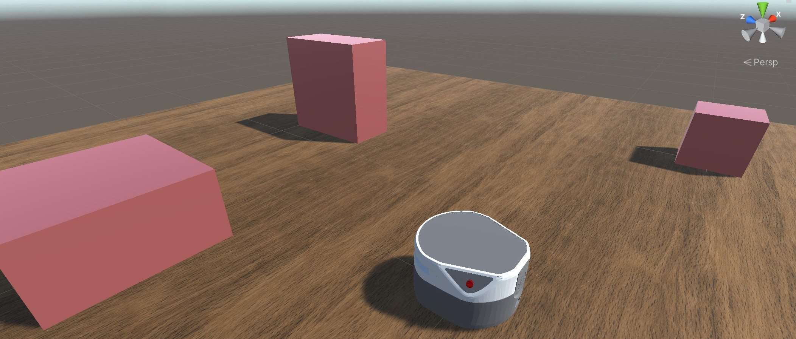

# Mobile-Robot-Demo-with-Unity-ROS

## Dependencies

This repository has been developed and tested in **Ubuntu 18.04 and ROS Melodic**, with **Unity 20.3.12f1 LTS**.

Before running this package, it is highly recommended to try the [Unity Robotics Hub](https://github.com/Unity-Technologies/Unity-Robotics-Hub) pick&place demo first. It shows the steps to import robot, convert messages, and communicate with ROS in details. But you could still run this package by following the steps below.

---

Clone this project by `git clone --recurse-submodules git@github.com:ZhuoyunZhong/Mobile-Robot-Demo-with-Unity-ROS.git  `

## Unity Setup

Open Unity Hub and click "Add" button. Select **Mobile Robot Demo** folder. Now you could open the added project Mobile Robot Demo. 

## ROS Setup

This

## Running Mobile Robot

## TODO List
