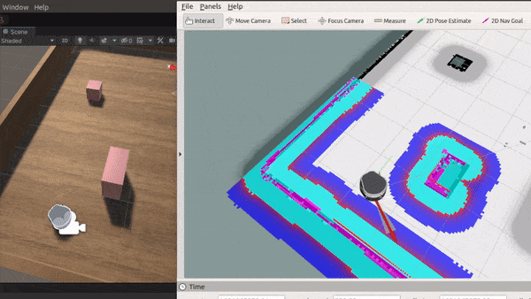

# Mobile-Robot-Demo-with-Unity-ROS

## Dependencies

This repository has been developed and tested in **Ubuntu 18.04 and ROS Melodic**, with **Unity 20.3 LTS**. Other later versions of ROS and Unity should also work.

Before running this package, it is highly recommended to try the [Unity Robotics Hub](https://github.com/Unity-Technologies/Unity-Robotics-Hub) pick&place demo first. It shows the steps to import robot, convert messages, and communicate with ROS in details. But you could still run this package by following the steps below.

# Tutorial

Clone this project by `git clone --recurse-submodules git@github.com:ZhuoyunZhong/Mobile-Robot-Demo-with-Unity-ROS.git  `

### [Part 1: Unity Setup](part1_unity.md) 

This part includes how to import the mobile robot in Unity scene, and control the mobile robot with your keyboard.

### [Part 2: Sensors](part2_sensors.md) 

This part includes how to attach common sensors: camera, laser and robot state readers to the robot.

### [Part 3: ROS Setup](part3_ros.md) 

This part includes how to add ROS communication scripts and set up the ROS node to communicate with robots in Unity.

### [Part 4: ROS Navigation Autonomy](part4_ros_nav.md) 

This part includes how to make use of ROS packages to achive mapping the environment, localizing robot and autonomous navigation.

# Mobile manipulator robot and more

This repository serves as a basic tutorial of setting up mobile robot in Unity simulation. If you are intested in more about ROS-Unity robot simulation. Please feel free to try our repository Gopher In Unity Simulation.

## TODO List

- RGB-D Camera / Pointcloud
