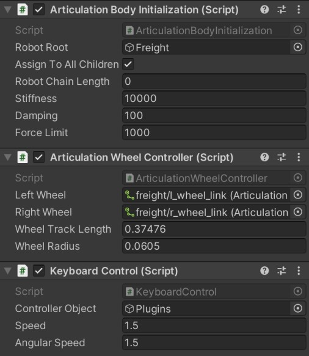
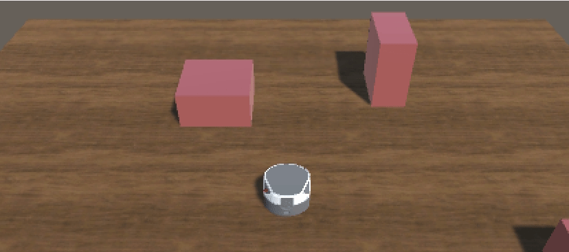

## Unity Setup

Open Unity Hub and click "Add" button. Navigate to the repository folder and select **Mobile Robot Demo** folder. Now you could open the added project **Mobile Robot Demo.** 

---

In this demo, we are using robot [freight robot base](https://fetchrobotics.com/freight100-oem-base/) as demonstration. 

To import the robot in Unity

- Navigate to `Assets/Scenes` and open scene `Demo`. 
- Navigate to `Assets/URDF`, right click `freight.urdf` and click **Import Robot from Selected URDF file**, then **Import URDF**. You will see the robot being imported in the scene.

As the robot is using [ArituclationBody](https://docs.unity3d.com/2020.1/Documentation/ScriptReference/ArticulationBody.html) chain, we are not able to move the game object with Transform or Rigidbody methods anymore. In order to navigate the robot, we will need to actually move the wheels. 

To ensure proper collision between wheels and the floor, the original mesh collider of the wheels need to be changed. 

- In the Freight hierarchy, navigate to `.../freight/l_wheel_link/Collisions` and delete the `unnamed` game object under `Collisions`. 
- Click `Collisions`, and in the **Inspector** window, under the Urdf Collisions script, select **Sphere** as **Type of collision** (The cylinder is not working), and click **Add collision**. A new unnamed game object is now generated.
- Navigate to `.../freight/l_wheel_link/Collisions/unnamed/Sphere`, adjust the radius to 0.0605. You should see the collider surrounding the wheel.
- Repeat the same process for the right wheel.

---

Now that we have the colliders properly set up, we will need to initialize and move the wheels. In the [Pick & Place demo](https://github.com/Unity-Technologies/Unity-Robotics-Hub/tree/main/tutorials/pick_and_place), they provide a sample controller `Controller.cs`, attached to the game object root "Freight". However, using its control logic to move the wheel will cause an undesired "moving-back motion" when the robot stops. Therefore, we will use different scripts to initialize and control the joints.

- Remove or disable / unclick the Controller component in `Freight`.
- Navigate to `Freight/Plugins`, click **Add Component**, search **Articulation**, then add **Articulation Body Initialization** and **Articulation Wheel Controller**. 
- The **Articulation Body Initialization** script will initialize all the non-fixed articulation joints by assigning stiffness, damping and force limit. In the **Robot Root** slot, drag and drop `Freight`, the game object root or `freight/base_link`.
- The **Articulation Wheel Controller** helps to convert input linear velocity and angular velocity into wheel speed for differential drive robot. Drag and drop the two wheel articulation body objects in the slots, and enter the relative track length and wheel radius. In this case, they are 0.37476 and 0.0605 respectively.
- After having scripts to initialize and control the joints, we need to send the control signals to the robot. Navigate to `Freight/Plugins`, click **Add Component**, this time, search **keyboard**, then add **Keyboard Control**. In the controller object slot, we need to put in the game object in which the Wheel Controller is saved, in this case, the `Plugin`.

- Finally, we can now run the Unity, and try to control the robot with your keyboard. Also, by now, you will have the same setup as scene **RobotImported**.

