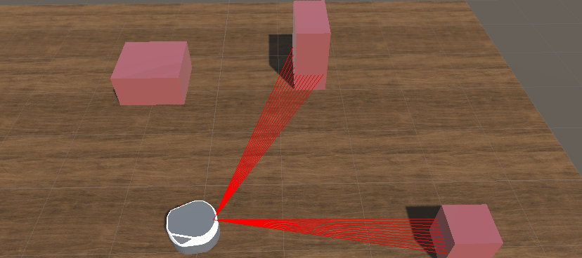

### Part 2: Sensors

This part includes how to attach common sensors, camera, laser and robot state readers to the robot.

---

Now we have control interface setup, let's attach some sensors and state readers to the robot.

- Navigate to `.../freight/base_camera_link`, right click and select **Camera** to create a camera game object. Click the new added **Camera** object, then in the inspector, you could click **Physical Camera** for more realistic camera, change **FOV** settings, etc. 

  To view this robot camera in Game view, you could set its **Target Display** to Display 2 or set the **Main Camera** to Display 2.

  Also, make sure there is only one **Audio Listener** in the scene. You could unclick **Audio Listener** of the main camera or the newly added camera.

  

- To add a laser scan, navigate to `Freight/Plugins` and click **Add Component**, search **Laser**, then add it. In the Laser Link slot, drag and drop`freight/laser_link`. To visualize the laser scan ray, you could click **Visualization**. After you run Unity, the rays will and only will show up in the Scene view, but not Game view, as the visualization is only for Debug purpose. After making sure the laser is properly working, disable **Visualization** to improve performance.

- Finally, we will need a script to read the states of the robots, its position, orientation, velocity, joint states, etc. Navigate to `Freight/Plugins` and click **Add Component**, search **State Reader**, then add it. This time, we will need to drag and drop `.../freight/chassis_link` as the robot we are tracking, because `base_link` and `Goopher` are not changing their transforms. You should be able to see all in information of the robot, including position, orientation, velocities and joint states. Please be noted that the robot velocities are with respect to the local frame.

- By now, you should have the same setup as scene **RobotWithSensors**.

---

Back to [Part 1: Unity Setup](part1_unity.md) 

Proceed to [Part 3: ROS Setup](part3_ros.md) 

