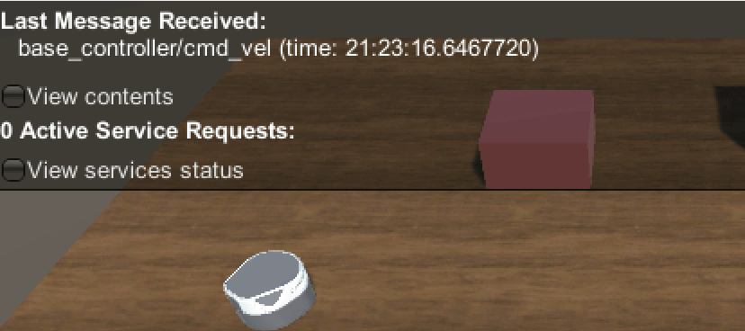
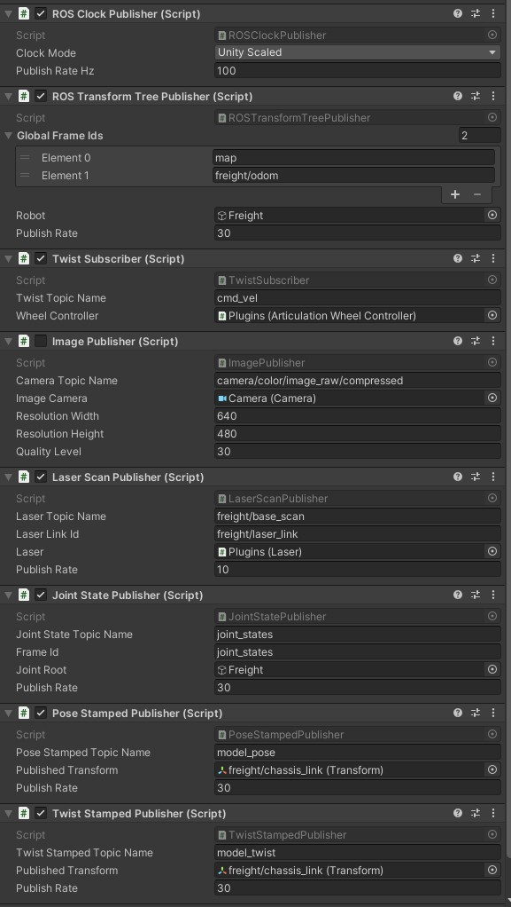
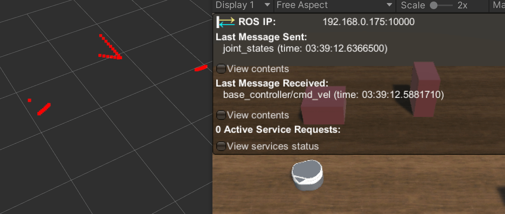

### Part 3: ROS

This part includes how to add ROS communication scripts and set up the ROS node to communicate with robots in Unity.

To communicate between Unity and ROS, we need to define subscribers and publishers C# scripts, and launch an endpoint on the ROS side.

---

On the ROS side

- Copy all the folders under **ROS** folder of this repository, and paste them to your catkin workspace. Build your catkin workspace again with `catkin_make`.

- All the topics used in this section, including camera, laser scan, control signal, etc, are defined in `server_endpoint.py`. For more details, please refer to  [Pick & Place demo](https://github.com/Unity-Technologies/Unity-Robotics-Hub/tree/main/tutorials/pick_and_place).

- You need to change the IP in `params.yaml` of the **config** folder to that of your machine. You can get the IP of your machine by  `hostname -I`.

- Now you could launch ROS node by 

  `roslaunch freight_endpoint server.launch`

On the Unity side

- click **Robotics** in the menu bar and click **ROS Settings**. Change the IP Address to your IP. This will generate a **ROSConnectionPrefab** in `Assets/Resources`, drag it to the Scene hierarchy.
- With the nodes launched, run Unity and you should be able to see they are connected successfully.

To send and receive messages from ROS, we will still need some subscribers and publishers scripts to send and receive messages. Some of the codes are originated from [ros-sharp](https://github.com/siemens/ros-sharp) and are modified to work with the new ROS-Unity framework. 

Let's create a new empty game object called **ROS** under `Freight` to store ROS-related scripts, or you could also add the scripts to `Freight/Plugins` as the previous ones. 

- Now in `Freight/ROS`, **Add Component**, and search **Subscriber** and add **Twist Subscriber**. This script subscribes the twist message from the ROS side and send the control signal to the wheel controller to move the robot. Now drag and drop the `Freight/Plugins` into Wheel Controller slot, and set the maximum linear and angular speed. As we are using control command from ROS side now, don't forget to disable the **Keyboard Control** in `Freight/Plugins`.

  Run the Unity simulation and launch the ROS node, send commands to topic `base_controller/cmd_vel` with packages like `teleop_twist_joy`. The robot should be able to follow your command.

- In terms of publishers, in `Freight/ROS`, **Add Component**, search **Publisher** and add publishers: **ROS Clock Publisher**, **ROS Transform Tree Publisher**, **Image Publisher**, **Laser Scan Publisher**, **Joint State Publisher**, **Pose Stamped Publisher** and **Twist Stamped Publisher**, based on your need. Don't forget to drag and drop proper game objects and setting publish rate after adding scripts.

- You can view the sent image by 

  `rosrun image_view image_view image:=/camera/color/image_raw`
  
  There are a few known issues with the camera publisher
  
  - This render mode does NOT support linear color space.
  - The renderer and encoder will slow down the frame rate dramatically. Disable it if you are not using it.
  
- You can view the laser scan with Rviz. Add a laser scan, select the `base_scan` topic and change the global fixed frame to `laser_scan`.

-  For the others, you could echo them to check if they are sent and received properly.

By now, you finish setting up a mobile robot demo, and you should have the same setup as the Scene **RobotROS**.

---

Back to [Part 1: Unity Setup](part1_unity.md) 

Back to [Part 2: Sensors](part2_sensors.md) 

