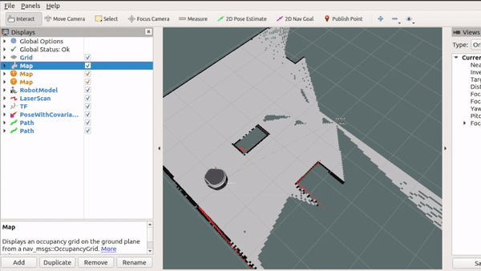
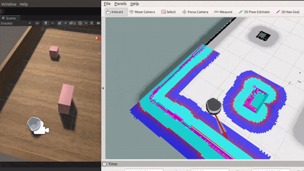

### Part 4: ROS Navigation Autonomy

This part includes how to make use of ROS packages to achive mapping the environment, localizing robot and autonomous navigation. We will be using navigation ROS packages to autonomously move the robot to a desired point in Unity simulation.

---

On the Unity side, we do not have to do anything more. We'll be using the same scene in part3.

On the ROS side, 

- you will need to install the following packages.

  - `sudo apt-get install ros-melodic-map-server`
  - `sudo apt-get install ros-melodic-gmapping`
  - `sudo apt-get install ros-melodic-amcl`
  - `sudo apt-get install ros-melodic-move-base`

- After installation, launch a different server file. This launch file includes the server endpoint nodee, the robot model, and Rviz.

  `roslaunch freight_endpoint freight_server.launch`

  Run Unity and have ROS Unity connected.

- You would need to build the map in the Unity environment with gmapping. Launch gmapping package.

  `roslaunch freight_navigation freight_gmapping.launch`

  You could directly use keyboard control in Unity to move the robot, or you may also want to control the robot by teleoperating with joystick.

  `roslaunch teleop_twist_joy teleop.launch`

  After launching, you would see an initial map in Rviz, with most of the space empty. Move your robot around and you will see that the map is built gradually. 
  
  
  
  After the whole map is built, manually save the map by

  `rosrun map_server map_saver -f <map_file_name>`

  move both the <map_file_name>.pgm and <map_file_name>.yaml files under **freight_navigation/maps**. Also, change "map_name" argument in **freight_navigation.launch** to <map_file_name>. 
  
  Now you can kill the freight_mapping and teleop terminal.

- Stop and rerun Unity. Also, kill and rerun "freight_server.launch". Get ROS and Unity connected. Now, launch another launch file

  `roslaunch freight_navigation freight_navigation.launch`

  which includes:

    - Launching the built map with `map_server`.

    - Launching the localization package `amcl` to localize the robot.

    - Launching `move_base` which provides global planner and local planner to autonomously navigate the robot to a desired point.

  You could set a desired goal using "2D Nav Goal" button the in Rviz interface. The move_base packages would plan a trajectory and the robot should be able to follow it to a valide goal.

  

---

Back to [Part 1: Unity Setup](part1_unity.md) 

Back to [Part 2: Sensors](part2_sensors.md) 

Back to [Part 3: ROS](part3_ros.md) 
